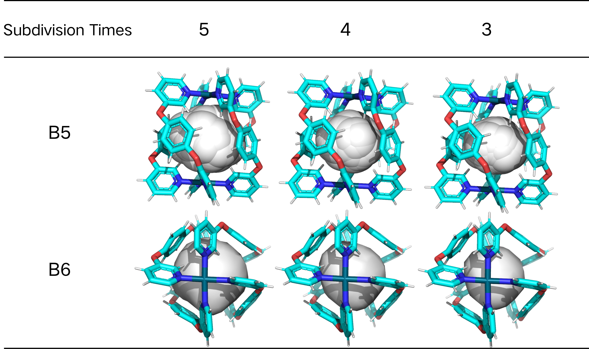

# Supporting Information

The document serves as supporting material for "EXPANDING BALLOON : Robust Computational Method for Morphology of Supramolecular Cage Cavities Based on the “Inflating Balloons” Metaphor". It provides further explanations of four parts of the paper: comparison of working parameters [(S1)](#s1-compare-working-parameter), center selection experiment [(S2)](#s2--center-selection-experiment-reult), CMCC vertex result conversion [(S3)](#s3--parameters-selection-and-experimental-results),  experimental parameters and results of the baseline dataset [(S4)](#s4--CMCC-result-convert), and detail of step length selection experiment[(S5)](#s5--step-length-selection-experiment). For detailed information on how to install and use CMCC, please refer to the GitHub repository for comprehensive documentation and source code.

## S1: Compare working parameter

### Table S1 : KVFinder project detecte properties. 

| Supramolecular Cage Identifier | Step (Å) | Probe Out (Å) | Removal Distance (Å) | Volume Cutoff (ų) |
|:------------------------------:|:-------:|:------------:|:--------------------:|:------------------:|
|              A1                |  0.25   |      10      |         0.75         |         80         |
|              B1                |  0.25   |      10      |         2.00         |          5         |
|              B2                |  0.25   |      10      |         1.75         |          5         |
|              B3                |  0.25   |      10      |         1.50         |         20         |
|              B4                |  0.25   |      10      |         1.50         |          5         |
|              B5                |  0.25   |      10      |         1.50         |          5         |
|              B6                |  0.25   |      10      |         1.50         |          5         |
|              B7                |  0.25   |      10      |         1.50         |         110        |
|              B8                |  0.25   |      10      |         1.50         |         25         |
|              B9                |  0.25   |      10      |         1.50         |          5         |
|              B10               |  0.25   |      10      |         1.50         |          5         |
|              B11               |  0.25   |      10      |         1.50         |          5         |
|              B12               |  0.25   |       6      |         1.50         |          5         |
|              B13               |  0.25   |       6      |         1.50         |          5         |
|              C1                |  0.25   |      10      |         1.00         |          5         |
|              F1                |  0.25   |      10      |         1.25         |          5         |
|              F2                |  0.60   |      20      |         3.50         |          5         |
|              H1                |  0.25   |      10      |         2.00         |          5         |
|              N1                |  0.25   |      10      |         1.50         |          5         |
|              O1                |  0.25   |      10      |         1.25         |         80         |
|              O2                |  0.25   |      20      |         1.25         |          5         |
|              W1                |  0.25   |      10      |         1.75         |         20         |

### Table S2 : Fpocket detection parameters for each supramolecular cage. 
| Supramolecular Cage Identifier | Minimum Radius of an Alpha Sphere (Å) | Maximum Radius of an Alpha Sphere (Å) |
|:------------------------------:|:------------------------------------:|:------------------------------------:|
|              A1                |                 3.4                  |                 8.0                  |
|              B1                |                 3.4                  |                 8.0                  |
|              B2                |                 3.4                  |                 8.0                  |
|              B3                |                 3.4                  |                 8.0                  |
|              B4                |                 3.4                  |                 8.0                  |
|              B5                |                 3.0                  |                 6.2                  |
|              B6                |                 3.4                  |                 8.0                  |
|              B7                |                 3.4                  |                 8.0                  |
|              B8                |                 3.4                  |                 8.0                  |
|              B9                |                 3.4                  |                 8.0                  |
|             B10                |                 3.4                  |                 8.0                  |
|             B11                |                 3.4                  |                 8.0                  |
|             B12                |                 3.4                  |                 8.0                  |
|             B13                |                 3.4                  |                 8.0                  |
|              C1                |                 3.4                  |                 8.0                  |
|              F1                |                 2.0                  |                 6.2                  |
|              F2                |                 3.4                  |                40.0                  |
|              H1                |                 3.4                  |                 6.2                  |
|              N1                |                 3.7                  |                 8.0                  |
|              O1                |                 3.4                  |                 6.2                  |
|              O2                |                 3.4                  |                 6.2                  |
|              W1                |                 4.0                  |                 7.0                  |

### Table S3 : Cavity volumes calculated with C3 using a grid spacing of 0.5 Å and a distance threshold for the 90-degree calculation of 2 times the window size. For the Dataset 2, all run properties are default.
| Supramolecular Cage Identifier | C3 Calculated Volume (ų) | Guest vdW Volume (ų) | Estimated Cavity Volume Using Rebek’s Rule (ų) | Relative Error (%) |
|:------------------------------:|:-------------------------:|:---------------------:|:--------------------------------------------:|:------------------:|
|              B1                |            298            |          150          |                     273                      |        9.2         |
|              B2                |            292            |          155          |                     281                      |        3.8         |
|              B3                |            267            |          137          |                     248                      |        7.7         |
|              B4                |            422            |          309          |                     562                      |       -24.9        |
|              B5                |             63            |           50          |                      90                      |       -29.8        |
|              B6                |             64            |           53          |                      96                      |       -33.4        |
|              B7                |            749            |          519          |                     944                      |       -20.6        |
|              B8                |            726            |          512          |                     930                      |       -21.9        |
|              B9                |             85            |          141          |                     257                      |       -66.9        |
|             B10                |            263            |          151          |                     274                      |        -4.1        |
|             B11                |            448            |          307          |                     558                      |       -19.8        |
|             B12                |            708            |          524          |                     954                      |       -25.8        |
|             B13                |            828            |          618          |                    1123                      |       -26.2        |
|                                |                           |                       |               **MRAE (%)**                   |        22.6        |

## S2 : Sphere center selection experiment reult

The following tables demonstrate the impact of the choice of sphere center on the results. The first row for each data presents the estimated cavity volume results, the cavity volume results calculated based on different point, and subdivision times parameter. The second row is the number of extension time(ET) for each result calculation. The third row is the relative error(RE) for each result calculation. As described in the paper, because many of the molecular cage data are affected by other forces such as hydrogen bonding, the actual cavity volume is smaller than the Rebek's rule based estimate. Therefore, we introduced the publication volume of the supramolecular cage to revise our results during the evaluation. The final result is the average of the two calculated results.

### Table S4 : Sphere center influence

| Supramolecular Cage | Estimated\Reference Cavity Volume (ų) | Centroid(ų) | Center of Mass(ų)  | Symmetrical Point(ų) | Subdivision Times |
|:------------------------------:|:-------------------:|:------:|:--------:|:-----------------:|:-----:|
|              B1                |         273         | 312    | 303      |  314              |   4   |
|                                |         ET =         |  31  | 31   |   31   |       |
|                                |         RE =         | 14.2 |10.9  |15.0    |       |
|              B2                |       281/285       | 318  | 314  |  318   |   4   |
|                                |        ET =          |  33  | 33   | 33     |       |
|                              |          RE =        | 13.1/11.5 |11.7/10.1  |13.1/11.5    |       |
|              B3                |       248/270       | 293  | 296  |  296   |   4   |
|                                |        ET =         |  32  | 30   |   32   |       |
|                                |        RE =          |  18.1/8.5|19.3/9.6  |  19.3/9.6  |       |
|              B4                |       562/434       | 508  | 505  |  524   |   5   |
|                                |        ET =        |         28          | 24   | 30   |        |       |
|                                |        RE =          |     -9.6/17.0     |-10.1/16.3|-6.7/20.7|    |       |
|              B5                |        90/52        | 77   | 78   |   79   |   4   |
|                                |        ET =        |         20          | 20   | 18   |        |       |
|                                |       RE =          |     -14.4/48.0     |-13.3/51.9|-12.2/51.9|    |       |
|              B6                |        96/55        | 74   | 74   |   74   |   4   |
|                                |        ET =         |         16          | 16   | 16   |        |       |
|                                |        RE =         |     -22.9/34.5     |-22.9/34.5|-22.9/34.5|    |       |
|              B7                |       944/810       | 944  | 890  |  979   |   5   |
|                                |        ET =         |         38          | 36   | 43   |        |       |
|                                |       RE =         |      0/16.5    | -5.7/9.8 |3.7/20.8|    |       |
|              B8                |         930         | 872  | 861  |  914   |   5   |
|                                |        ET =         |         31          | 31   | 31   |        |       |
|                                |        RE =         |    -6.2    |-7.4|-1.7|    |       |
|              B9                |       257/184       | 225  | 226  |  225   |   4   |
|                                |        ET =         |         20          | 20   | 18   |        |       |
|                                |        RE =         |     -12.4/22.2     |-12.0/22.8|-12.4/22.2|    |       |
|             B10                |       274/261       | 291  | 288  |  291   |   4   |
|                                |        ET =        |         34          | 34   | 35   |        |       |
|                                |        RE =         |      6.2/11.4    |5.1/10.3|6.2/11.4|    |       |
|             B11                |         558         | 557  | 554  |  554   |   5   |
|                                |        ET =         |         47          | 49   | 47   |        |       |
|                                |       RE =          |      -0.1    |-0.7|-0.7|    |       |
|             B12                |        954/718      | 720  | 720  |  721   |   5   |
|                                |         ET =         |         29          | 29   | 31   |        |       |
|                                |        RE =         |     -24.5/0.2     |-24.5/0.2|-24.4/0.4|    |       |
|             B13                |      1123/925       | 845  | 846  |  850   |   5   |
|                                |       ET =          |         39          | 39   | 38   |        |       |
|                                |       RE =          |     -24.7/-8.6     |-24.6/-8.5|-24.3/-8.1|    |       |
|           **MEAE (%)**         |                     |14.1|13.9|14.3|   -   |
|             **Times**          |                     |    30.3    |29.9|30.6|    -   |

## S3 : Parameters selection and experimental results

### Table S5 : Parameters and calculation result of dataset 1  

| **Cage**                      | **Estimated Volume (ų)** | **CMCC Result (ų)** | **Subdivision Times** | **Result**                           |
|:----------------------------------:|:-------------------------:|:--------------:|:-----------------:|:-----------------------------------:|
| **B1**                        | 273                       | 303            | 4                 |    |
| **B2**                        | 281                       | 314            | 4                 |    |
| **B3**                        | 248                       | 296            | 4                 |    |
| **B4**                        | 562                       | 455            | 5                 |    |
| **B5**                        | 90                        | 78             | 4                 |    |
| **B6**                        | 96                        | 74             | 4                 |    |
| **B7**                        | 944                       | 890            | 5                 |    |
| **B8**                        | 930                       | 861            | 5                 |    |
| **B9**                        | 257                       | 226            | 4                 |    |
| **B10**                       | 274                       | 288            | 4                 |   |
| **B11**                       | 558                       | 517            | 5                 |   |
| **B12**                       | 954                       | 720            | 5                 |   |
| **B13**                       | 1123                      | 846            | 5                 |   |

### Table S6 : Parameters and calculation result of dataset 2

| **Cage** | **Reference/Average Volume (ų)** | **CMCC Result (ų)** | **Subdivision Times** |                      **Result**                      |
|:--------:|:----------------------------------:|:--------------:|:-----------------:|:----------------------------------------------------:|
|  **A1**  | 1375                               | 1455           | 5                 |  |
|  **C1**  | 549                                | 592            | 5                 |  |
|  **F1**  | 500                                | 480            | 5                 |  |
|  **F2**  | 42572                               | 32350          | 5                 |  |
|  **H1**  | 259                                | 167            | 4                 |  |
|  **N1**  | 434                                | 407            | 4                 |  |
|  **O1**  | 142                                | 95             | 4                 |  |
|  **W1**  | 400                                | 433            | 4                 |  |
|  **O2**  | 20                                 | 27             | 4                 |  |

The selection of parameters in the experiment is primarily based on two principles: data analysis results of subdivision times and comparison of visualization results.   First, we examine the impact of subdivision times on the calculation results for dataset 1 from the paper.   The CMCC method's first step is the grid's subdivision surface .   This step is similar to grid partitioning in grid-based methods, where the number of divisions affects the precision and computation time of the final results.   Figure 2 shows the relationship between subdivision times (ST) and CMCC computation time.  Due to the subdivision surface algorithm causing an exponential increase in the number of vertices, the corresponding computation time also increases with the times of subdivision surface.  It is evident that after six grid divisions, the computation time reaches an unacceptable magnitude (55 seconds).   Therefore, the subdivision parameters should only be between 3, 4, and 5.   In Figure 2, the blue, green, and yellow lines represent the calculation results for subdivision times of 3, 4, and 5, respectively.

  
   <em>Figure 1: The effect of the subdivision times on the calculation time.</em>

By observing the graphs, it can be concluded that CMCC yields better results for larger supramolecular cages (Cavity Volume > 500) when ST = 5. However, for other supramolecular cage cavity calculations, the impact of ST on the results is not significant, as shown in Figure 3A. Hence, we introduced the Origin Publication cavity volume as a comparison parameter based on Rebek's rule (Figure 3B). ST = 3 has higher calculation accuracy for smaller supramolecular cages. ST = 4 shows more stable and higher accuracy across both calculation references. To further explore the choice of calculation parameters, we visualized the data with smaller cavity volumes (B5, B6).

By comparing the visualization results, the shape of the calculated results did not change, the size did.    We believe the change in size is due to finer probes exploring small spaces between atoms—spaces that cavity guest molecules cannot physically reach.    moreover, by combining the charts, It is evident that these small spaces are not considered part of the supramolecular cage's cavity (fewer vertices result in higher accuracy).    Therefore, we conclude that results for ST = 3 or 4 are acceptable compared to ST = 5.    Considering the comparison with mean absolute error(dotted line in Figure 3), we ultimately recommend using ST = 4 as the parameter when the volume of the supramolecular cage is less than 500.

  
   <em>Figure 2: The effect of the subdivision times on the final result.</em>

  
   <em>Figure 3: Cavity visualization results of B5 and B6.</em>

## S4 : CMCC result convert
Current mainstream biomolecular results are typically saved and presented in formats such as pdb and mol2. However, the results from CMCC are displayed in the form of vertex meshes. This format is not conducive for experts to further analyze supramolecular cages. To address this, we have developed a method to convert vertex data into pdb data for better presentation of our results. In this method, each vertex is replaced by a carbon atom. Compared to the vertex, a carbon atom has a van der Waals radius (1.7 Å). Therefore, we need to perform a reverse translation of 1.7 Å in the direction of atomic expansion. Figure 4 illustrates the corresponding conversion process. The black outline represents the outer contour of the surface before vertex conversion. The red and yellow outlines represent the inner and outer surface contours after conversion. Figure 4E shows the result after the vertices have been translated.

  
  
<em>Figure 4: CMCC Result Convert Process.</em>

## S5 : Step length selection experiment

In order to select the optimal step length, we conducted experiments using various step lengths. The experiments evaluated the impact of step length on MRAE and cost time for each cavity calculation(Table S7). The results indicate that a step length of 0.1 Å achieves a balance between MRAE and cost time.

### Table S7 : Parameters and Calculation Result of Dataset 2
| **Step Length(Å)** | **0.01** | **0.05** | **0.1** | **0.15** |**0.2**|
|:--------:|:----------------------------------:|:--------------:|:-----------------:|:----------:|:----------:|
| **MRAE(%)**   | 12.8                               | 12.9           | 12.9                 |13.2  |13.7|
| **Cost Time(S)**   | 36                                | 12.9            | 9.2                 |  10.6 | 11.3

