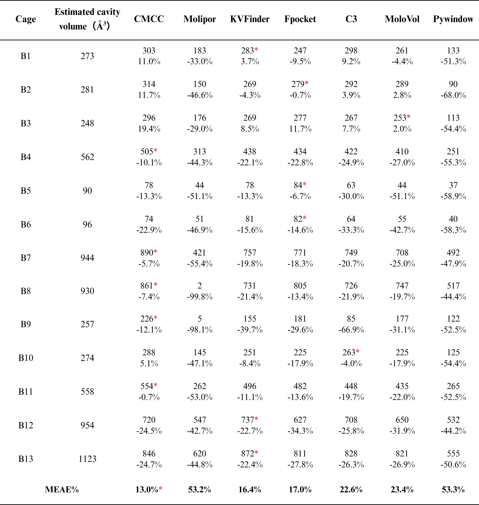
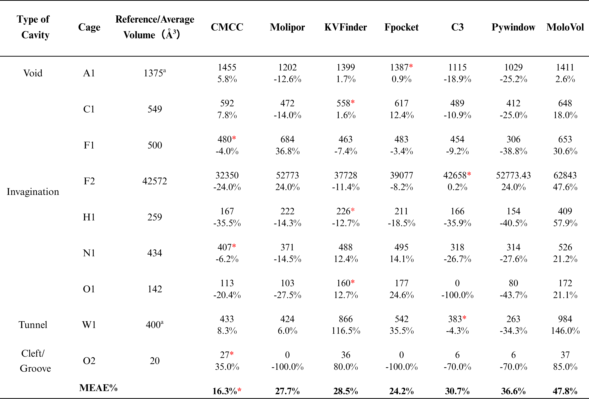

# Molipor-CMCC Comparison Project

This project preserves and compares the cavity calculation results between Molipor (from [J. Chem. Theory Comput. 2019, 15, 787−798](https://pubs.acs.org/doi/10.1021/acs.jctc.8b00764)) and CMCC datasets.

## Workflow Overview

1. **File Conversion Pipeline**:
   - Original PDB files (CMCC dataset) → converted to MOL2 format using PyMOL
   - MOL2 files → V3000 MOL format using `Mol2_to_Mol-v3000.py`
   - V3000 MOL files processed by Molipor to generate cavity points

2. **Output Files**:
   - Molipor generates `voronoi_interior.vtk` files for each molecule (stored in `Molecules_Output`)
   - These files contain Voronoi diagram points inside cavities

3. **Volume Calculation**:
   - VTK → PDB conversion using `convert_vtk2pdb.py` (results in `Cavity_pdb_result`)
   - For each interior Voronoi point, we calculate the maximum atomic radius that does not collide with the supramolecular cage and store it in the PDB file.  
      Before:        After:
   - Volume calculation using `Volume.py`(Volume.py calculates the volume in grid-based mode. In the experiment, the mesh size is 0.2Å)

4. **Result Visualization**
   - Import "*_voronoi_spheres.pdb" to PyMol.
   - PyMOL processing:  
     ```pymol
     alter all, vdw = b
     rebuild
     show spheres
     ```


## Directory Structure
project_root/  
│  
├── Molecules_Output/ # Molipor output files  
├── Cavity_pdb_result/ # Converted PDB files  
├── dataset-1 & dataset-2/ # PDB and Mol type dataset  
├── Mol2_to_Mol-v3000.py # MOL2 to V3000 converter  
├── convert_vtk2pdb.py # VTK to PDB converter  
├── Dataset-1/2_volume_result # Statistical result  
└── README.md # This file  

## Volume Result

**Dataset 1**  
 

**Dataset 2**  
 

## Requirements

- [PyMOL](https://pymol.org/)
- Python environment for script execution

## References

Original Molipor paper:  
[1]García I G, Bernabei M, Haranczyk M. Toward automated tools for characterization of molecular porosity[J]. Journal of Chemical Theory and Computation, 2018, 15(1): 787-798.